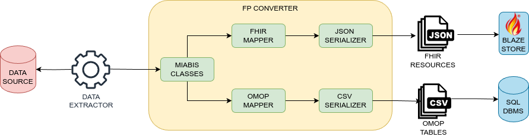

# BBMRI Federated Platform Converter

This project consists in a software framework to support the implementation of
tools to read and convert data about biomedical samples into formats compatible
with the [BBMRI Federated
Platform](https://www.bbmri-eric.eu/federated-platform/). In particular, the
framework supports the conversion of data into FHIR Resources for the [BBMRI
Sample Locator](https://locator.bbmri-eric.eu/) and in OMOP for the [BBMRI
Finder](https://finder.bbmri-eric.eu/).

The framework implements an internal data model compatible with [MIABIS](https://github.com/BBMRI-ERIC/miabis).

To implement conversion from a new source, a new concrete class extending
`AbstractSource` should be implemented to create the MIABIS classes. The
instances of these classes will be automatically converted and serialized by
the framework for the needed Federated Platform solution.

The following diagram illustrates the flow ETL process implemented by the framework:



An example of a class implementing a source from a mock dataset can be found in
`examples` directory.

## Dependencies

* Python >= 3.12
* [Poetry](https://python-poetry.org/)

All other Python dependencies will be installed by Poetry. Run the following
command in the project directory to complete the installation:

```commandline
poetry install
```

Note: you may want to create and activate a Python virtual environment prior to
installing the framework and its dependencies.

## Usage

The package can convert data about aggregated objects (i.e., biobanks and collections) or about cases.
The source can provide data about one type of entity or both: indeed in some cases, the Case data may refer to a
collection/biobank whose data are taken from another source (e.g., the collections and biobanks are from the
BBMRI Directory).

Depending on the type of data the source provides, some methods of the `AbstractSource`
class may not be require implementations: if biobank data are provided, the
method `get_biobanks_data` must be implemented; on the other hand, if sample
data is provided, the method `get_cases_data` must be implemented.

To generate data from a source a `Converter` must be instantiated with a Source and a Destination class.

An example is:

```python
source = ExampleSource()
output_dir = os.path.join(os.path.dirname(__file__), 'output')

if not os.path.isdir(output_dir):
    os.mkdir(output_dir)

destination = FHIRDest(JsonFile(output_dir))
c = Converter(source, destination, Converter.CASE)
c.run()
```

## License

This project is licensed under the terms of the [GNU Affero General Public
License v3.0 (GNU AGPLv3)](https://www.gnu.org/licenses/agpl-3.0.en.html). See the [COPYING](COPYING) for details.

## Acknowledgments

This work has been partially funded by the following sources:
* The [European Joint Programme on Rare Disease (EJPRD)](https://www.ejprarediseases.org/) project (grant agreement N. 825575);
* The [EOSC-Life](https://www.eosc-life.eu/) European project (grant agreement N. 824087), within the EOSC-Life WP1 Demonstrator “Cloudification of BBMRI-ERIC CRC-Cohort and its Digital Pathology Imaging” (APPID 1228);
* The “Total Patient Management” (ToPMa) project (grant by the Sardinian Regional Authority, grant number RC_CRP_077). Intervento finanziato con risorse FSC 2014-2020 - Patto per lo Sviluppo della Regione Sardegna;
